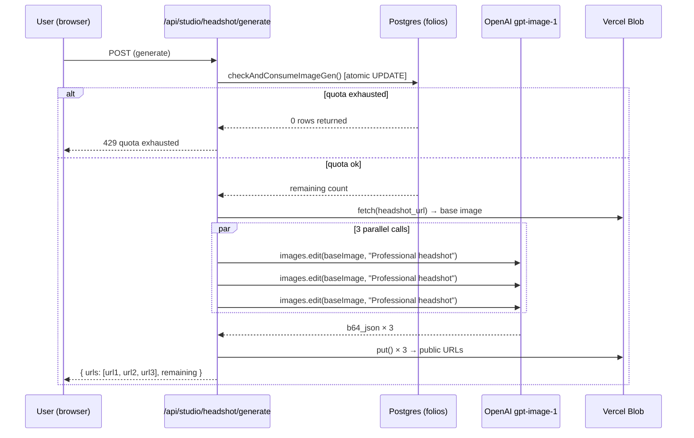

# ADR-007: AI Image Generation Provider — OpenAI gpt-image-1

**Date:** 2026-06-22
**Status:** Accepted
**Feature:** Profile headshot AI generation

---

## Context

The headshot feature includes AI-assisted generation: a user uploads or imports a base photo, clicks Generate, and receives three professional headshot options produced by an image model. The generation flow requires **image-to-image editing** — not text-to-image — because the output must be grounded in the user's actual likeness. A fixed prompt (`"Professional headshot"`) is used; no user-editable prompt is exposed, limiting the attack surface and keeping output quality consistent.

The platform already uses the Anthropic Claude API for the studio agent. Adding image generation requires a second provider, since Claude does not generate images.

---

## Options Considered

### Option A: OpenAI `gpt-image-1` via `images.edit`
OpenAI's latest image model supports native image editing: an input image plus a prompt produces an edited output. The `openai` npm package provides a typed client.

**Pros:**
- Single additional API key and npm package
- `images.edit` supports image-to-image natively — correct primitive for "make this photo more professional"
- Returns `b64_json` — no second CDN dependency for the generated output
- Well-documented, stable API surface

**Cons:**
- OpenAI dependency alongside Anthropic (two AI providers)
- `gpt-image-1` cost per image (~$0.04–0.08 at 1024×1024 standard quality)
- Image quality for portrait editing is good but not best-in-class for photorealistic results

---

### Option B: fal.ai with Flux or SDXL
fal.ai offers fast inference on Flux, SDXL, and portrait-specialist models via a simple HTTP API. Quality for portrait generation is often superior to DALL-E variants.

**Pros:** Best-in-class portrait quality, faster inference, lower per-image cost

**Cons:** Third API account and credential to manage, less mature TypeScript SDK, less predictable output format across model versions. Adds integration complexity for marginal quality improvement at portfolio scale.

---

### Option C: Replicate
Hosted inference for hundreds of open-source models via a unified API.

**Pros:** Broad model selection, can switch models without changing provider

**Cons:** Asynchronous job-polling model (not synchronous response) — requires webhook or polling loop, which complicates the "generate and return 3 URLs" handler. Adds latency and implementation complexity. Rejected due to the async model mismatch with the synchronous Next.js route handler pattern used elsewhere.

---

### Option D: Stability AI
Stable Diffusion via Stability's hosted API.

**Pros:** Strong open-source lineage, competitive pricing

**Cons:** Fourth option with no clear advantage over the others for this specific use case. Stability's API surface has changed significantly across versions; the stability of the integration itself is a concern for a low-maintenance portfolio project.

---

## Decision

**OpenAI `gpt-image-1` via `images.edit` (Option A).**

The deciding factors were **integration simplicity** and **API model fit**. The `images.edit` endpoint maps directly to the product requirement (image-in → edited image-out, synchronously). The `openai` package is a single `npm install`; the client is instantiated with `OPENAI_API_KEY` and requires no additional configuration. Three parallel `Promise.all` calls return results synchronously in the route handler — consistent with every other API route in the project.

The quality gap between Option A and Option B is real but acceptable for a demo-tier feature (3 generations/month per tenant). If portrait quality becomes a differentiator in a future iteration, swapping to fal.ai is a localized change to the generate route only.

---

## Architecture

---

## Consequences

- `OPENAI_API_KEY` must be set in Vercel environment variables
- Each "Generate" click costs approximately $0.12–0.24 (3 × standard 1024×1024 edit)
- The monthly quota (default: 3 per tenant) caps maximum cost per tenant per month at ~$0.75 — well within acceptable demo-tier spend
- Generated images are stored as temporary Blob objects; only the user-selected option is promoted to the canonical headshot path
